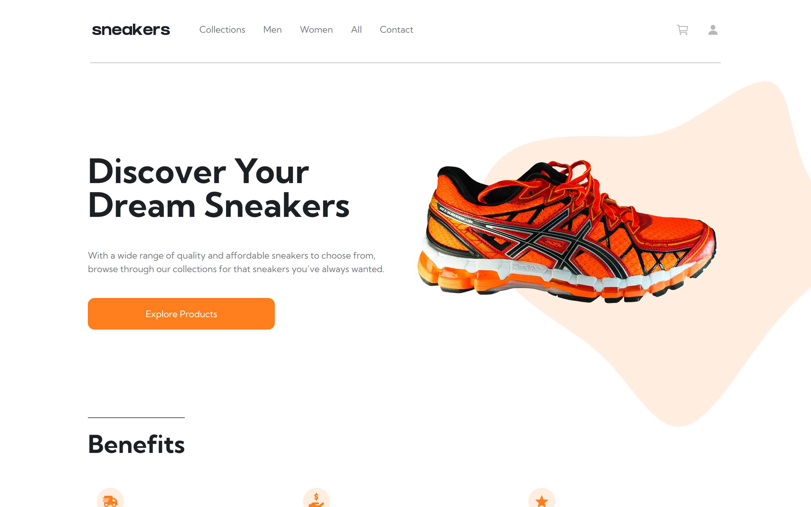

# Frontend Mentor - E-commerce product page solution

This is a solution to the [E-commerce product page challenge on Frontend Mentor](https://www.frontendmentor.io/challenges/ecommerce-product-page-UPsZ9MJp6). Frontend Mentor challenges help you improve your coding skills by building realistic projects.

## Table of contents

- [Overview](#overview)
  - [The challenge](#the-challenge)
  - [Screenshot](#screenshot)
  - [Links](#links)
- [My process](#my-process)
  - [Built with](#built-with)
  - [What I learned](#what-i-learned)
  - [Continued development](#continued-development)
  - [Useful resources](#useful-resources)
- [Author](#author)

## Overview

### The challenge

Users should be able to:

- Register and login
- Create cart, address, and order
- Update and delete cart and address, update password, cart, user info, and address
- View the optimal layout for the site depending on their device's screen size
- See hover states for all interactive elements on the page
- Open a lightbox gallery by clicking on the large product image
- Switch the large product image by clicking on the small thumbnail images
- Add items to the cart
- View the cart and remove items from it

### Screenshot

### Links

- Solution URL: [https://github.com/Hikmahx/sneakers-ecommerce-website](https://github.com/Hikmahx/sneakers-ecommerce-website)
- Live Site URL: [Sneakers MERN Ecommerce Website](https://sneakers-ecommerce-website.herokuapp.com/)

## My process

### Built with

- Semantic HTML5 markup
- Mobile-first workflow
- [React](https://reactjs.org/) - JS library
- [Tailwindcss](https://tailwindcss.com/) - CSS framework
- [Ionicons](https://ionicons.com) - Icons
- [MongoDB](https://www.mongodb.com/) - NoSQL database
- [Nodejs](https://nodejs.org/) - Back-end JavaScript runtime environment
- [Express](https://expressjs.com/) - Nodejs framework
- [Stripe](http://stripe.com/) - Online payment service provider 
- [Heroku](https://www.heroku.com/) -  Cloud Application Platform
- [Redux Toolkit](https://redux-toolkit.js.org/) - Toolset for efficient Redux development

### What I learned

This is my first deployed fullstack application using the MERN stack. As I progressed with this application, I find myself improving a lot and also learnt how to avoid specific mistakes and debug my app better. I believe this project has made it easier for me to make full stack applications better and faster.

### Useful resources

- [Lama Dev](https://www.youtube.com/c/lamadev) - If you want to create any MERN stack project, lama dev is the place to start from.
- [Dribble](dribbble.com) - Most of the inspiration for designing this website came from here. Be sure to check it out.
- [Logrocket](https://blog.logrocket.com/handling-user-authentication-redux-toolkit/) - I used this to understand better login, logout and registration process.
- [Unsplash](https://unsplash.com/) - This site is an endless reservior of images. I used this for my product images, using google image to find the names of the sneakers in the images.
- [Stack Overflow](https://stackoverflow.com) - As always, stackoverflow is the place I go whenever I need any help.
- [Example resource 2](https://www.example.com) - This is an amazing article which helped me finally understand XYZ. I'd recommend it to anyone still learning this concept.

## Author

- Github - [Hikmah Yousuph](https://github.com/Hikmahx)
- Frontend Mentor - [@Hikmahx](https://www.frontendmentor.io/profile/Hikmahx)
- Email - [hikmayousuph@gmail.com](hikmayousuph@gmail.com)
- LinkedIn - [Hikmah Yousuph](linkedin.com/in/hikmah-yousuph-449467204/)
